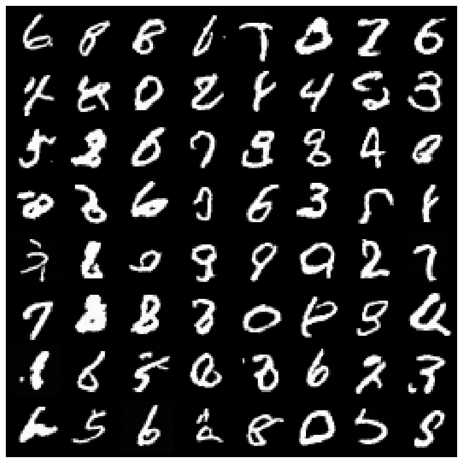
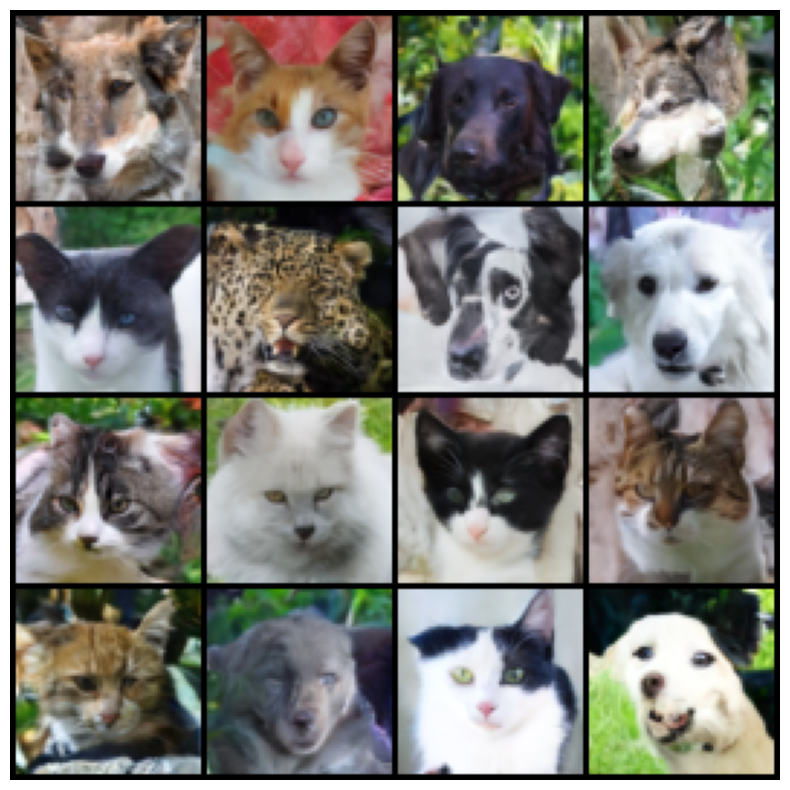
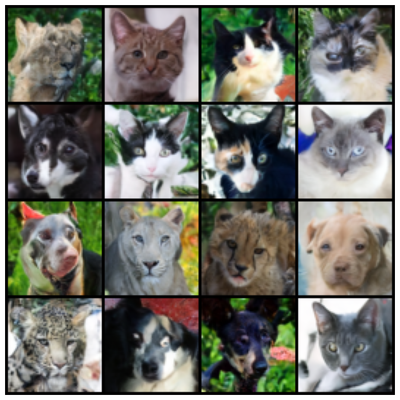
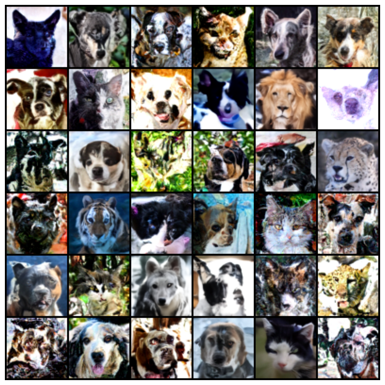
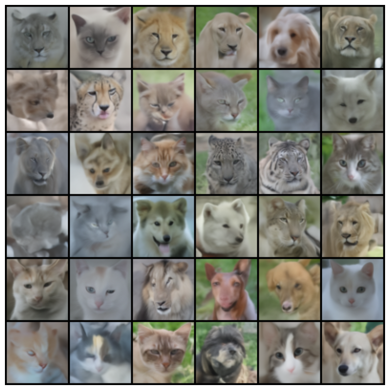
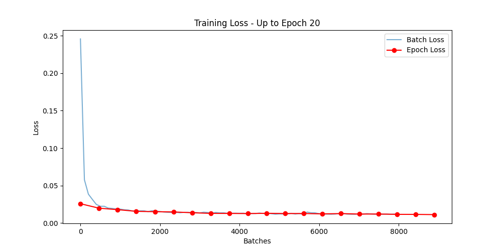
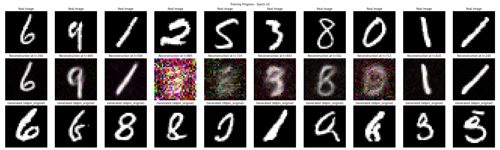

# DDPM (Denoising Diffusion Probabilistic Models) Implementation

A PyTorch implementation of Denoising Diffusion Probabilistic Models (DDPM) from scratch with support for multiple sampling methods including DDPM and DDIM sampling. This implementation features a custom U-Net architecture with self-attention and time embedding for high-quality image generation.

## 🌟 Features

- **Custom U-Net Architecture**: Implements a U-Net model with residual connections, self-attention, and sinusoidal time embeddings
- **Multiple Sampling Methods**: 
  - DDPM Original (Ho et al., 2020)
  - DDPM with X₀ prediction
  - DDIM Sampling (Song et al., 2020)
  - Accelerated DDIM Sampling
- **Flexible Noise Schedules**: Linear and cosine beta schedules
- **Training Pipeline**: Complete training loop with visualization and checkpoint saving
- **Pre-trained Models**: Includes trained models for MNIST and AFHQ datasets

## 📁 Project Structure
Download the model weights for AFHQ from [here](https://drive.google.com/file/d/15moXiLwrs0lr2vl991Lj-IGvJauwlQU-/view?usp=sharing) and MNIST from [here](https://drive.google.com/file/d/1OeT1MvDtRV80xevrSJtyuXxP_zGBNfFh/view?usp=sharing) and keep those in their respective directories, so that the final project structure looks like as shown below:

```
ddpm_pipeline/
├── models/                     # Model architectures
│   ├── unet.py                # Main U-Net model
│   ├── convBlockForUnet.py    # Convolutional blocks
│   ├── selfAttention.py       # Self-attention mechanism
│   ├── time_embedding.py      # Sinusoidal time embeddings
│   └── __init__.py
├── diffusion/                 # Diffusion algorithms
│   ├── scheduler.py           # Noise scheduling and sampling
│   ├── schedule_self.py       # Alternative scheduler implementation
│   └── trainer.py             # Training utilities
├── diffusion_training_mnist/  # Pre-trained MNIST model
│   ├── final_model.pt         # Trained model weights
│   ├── loss_plot.png          # Training loss curve
│   └── progress.png           # Training progress visualization
├── TrainedModel_AFHQ_64/     # Pre-trained AFHQ model (64x64)
│   └── diffusion_training_64/
│       └── final_model.pt     # Trained model weights
├── Generations/               # Sample outputs
├── GeneratedSamplesMNIST/     # MNIST sample outputs
├── train.py                   # Training script
├── sample.py                  # Sampling script
└── requirements.txt           # Dependencies
```

## 🚀 Quick Start

### Installation

1. Clone the repository:
```bash
git clone https://github.com/ayushraina2028/DDPM-2025.git
cd ddpm_pipeline
```

2. Install dependencies:
```bash
pip install -r requirements.txt
```

### Dependencies

- Python 3.8+
- PyTorch ≥ 1.9.0
- torchvision ≥ 0.10.0
- numpy ≥ 1.20.0
- matplotlib ≥ 3.4.0
- tqdm ≥ 4.61.0

## 🎯 Usage

### Generate Samples (Using Pre-trained Models)

#### MNIST Generation
```bash
python sample.py \
    --model_path ./diffusion_training_mnist/final_model.pt \
    --num_samples 16 \
    --image_size 32 \
    --output_dir ./generated_mnist \
    --sampling_method ddpm_predicted_x0 \
    --inference_steps 1000 \
    --save_grid
```

#### AFHQ Generation (64x64)
```bash
python sample.py \
    --model_path ./TrainedModel_AFHQ_64/diffusion_training_64/final_model.pt \
    --num_samples 16 \
    --image_size 64 \
    --output_dir ./generated_afhq \
    --sampling_method ddim_sampling \
    --inference_steps 50 \
    --save_grid
```

### Training from Scratch

```bash
python train.py \
    --batch_size 64 \
    --epochs 100 \
    --lr 1e-4 \
    --output_dir ./my_training_output \
    --image_size 64 \
    --sampling_method ddpm_predicted_x0
```

### Sampling Methods

The implementation supports four different sampling methods:

1. **`ddpm_original`**: Original DDPM sampling as described in Ho et al. (2020)
2. **`ddpm_predicted_x0`**: DDPM with direct x₀ prediction for faster convergence
3. **`ddim_sampling`**: DDIM sampling for deterministic generation with fewer steps
4. **`accelerated_ddim_sampling`**: Enhanced DDIM with improved acceleration

## 📊 Results

### MNIST Generation Results

| Method | Samples |
|--------|---------|
| DDPM Original |  |
| DDPM X₀ Prediction |  |

### AFHQ Generation Results

| Method | Samples |
|--------|---------|
| DDPM Original |  |
| DDPM X₀ Prediction |  |
| DDIM Sampling |  |
| Accelerated DDIM |  |

### Training Progress

| Dataset | Loss Curve | Sample Evolution |
|---------|------------|------------------|
| MNIST |  |  |

## 🏗️ Model Architecture

### U-Net Details
- **Input/Output Channels**: 3 (RGB) or 1 (grayscale)
- **Base Channels**: 64
- **Depth**: 3-4 levels with skip connections
- **Time Embedding**: 128-dimensional sinusoidal embeddings
- **Attention**: Self-attention at multiple resolutions
- **Activation**: SiLU (Swish) activation functions

### Noise Schedule
- **Linear Schedule**: β₀ = 0.0001, βₜ = 0.02
- **Cosine Schedule**: Improved schedule from Nichol & Dhariwal (2021)
- **Total Timesteps**: 1000 (customizable)

## 📚 Implementation Details

### Key Components

1. **`SimpleUNetModel`**: Core denoising network with:
   - Encoder-decoder architecture with skip connections
   - Time-conditional layers
   - Self-attention mechanisms
   - Residual connections

2. **`Diffusion_Scheduler`**: Handles:
   - Noise scheduling (linear/cosine)
   - Forward diffusion process
   - Multiple sampling algorithms
   - Timestep scheduling for inference

3. **Training Pipeline**: Features:
   - Progressive sample visualization
   - Loss tracking and plotting
   - Model checkpointing
   - Support for different datasets

### Sampling Efficiency

| Method | Steps Required | Quality | Speed |
|--------|---------------|---------|-------|
| DDPM Original | 1000 | High | Slow |
| DDPM X₀ Prediction | 1000 | High | Slow |
| DDIM | 50-250 | High | Fast |
| Accelerated DDIM | 20-50 | High | Very Fast |

## 🎛️ Configuration Options

### Training Parameters
- `--batch_size`: Training batch size (default: 64)
- `--epochs`: Number of training epochs (default: 50)
- `--lr`: Learning rate (default: 1e-4)
- `--image_size`: Input image resolution (default: 64)
- `--output_dir`: Directory for saving outputs

### Sampling Parameters
- `--num_samples`: Number of images to generate (default: 16)
- `--inference_steps`: Number of denoising steps (default: 1000)
- `--sampling_method`: Choice of sampling algorithm
- `--save_grid`: Save samples as a grid image

## 📄 Pre-trained Model Weights

### Available Models

1. **MNIST Model** (`./diffusion_training_mnist/final_model.pt`)
   - Resolution: 32×32
   - Training: 50 epochs on MNIST dataset
   - Architecture: Depth=3, Base channels=64

2. **AFHQ Model** (`./TrainedModel_AFHQ_64/diffusion_training_64/final_model.pt`)
   - Resolution: 64×64
   - Training: Animal faces (AFHQ dataset)
   - Architecture: Depth=4, Base channels=64

### Model Loading Example

```python
import torch
from models.unet import SimpleUNetModel

# Load pre-trained model
model = SimpleUNetModel(
    inChannels=3,
    outChannels=3,
    baseChannels=64,
    timeEmbeddingDimension=128,
    depth=3
)

# Load weights
device = torch.device('cuda' if torch.cuda.is_available() else 'cpu')
state_dict = torch.load('path/to/model.pt', map_location=device, weights_only=True)
model.load_state_dict(state_dict)
model.to(device)
model.eval()
```

## 🧪 Experimental Features

- **Multiple Beta Schedules**: Linear and cosine schedules
- **Accelerated Sampling**: Custom DDIM variants for faster generation
- **Flexible Architecture**: Configurable U-Net depth and channel sizes
- **Progress Visualization**: Real-time training progress monitoring

## 🤝 Contributing

Contributions are welcome! Please feel free to submit issues, feature requests, or pull requests.

## 👥 Author

**Ayush Raina** - [ayushraina2028](https://github.com/ayushraina2028)

---

